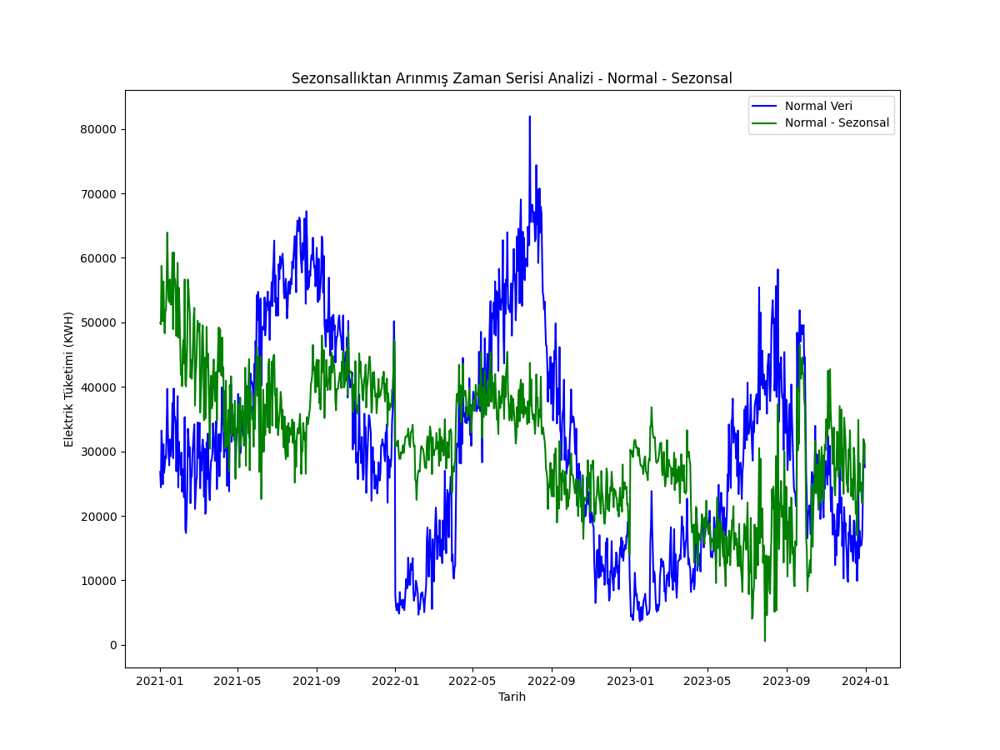
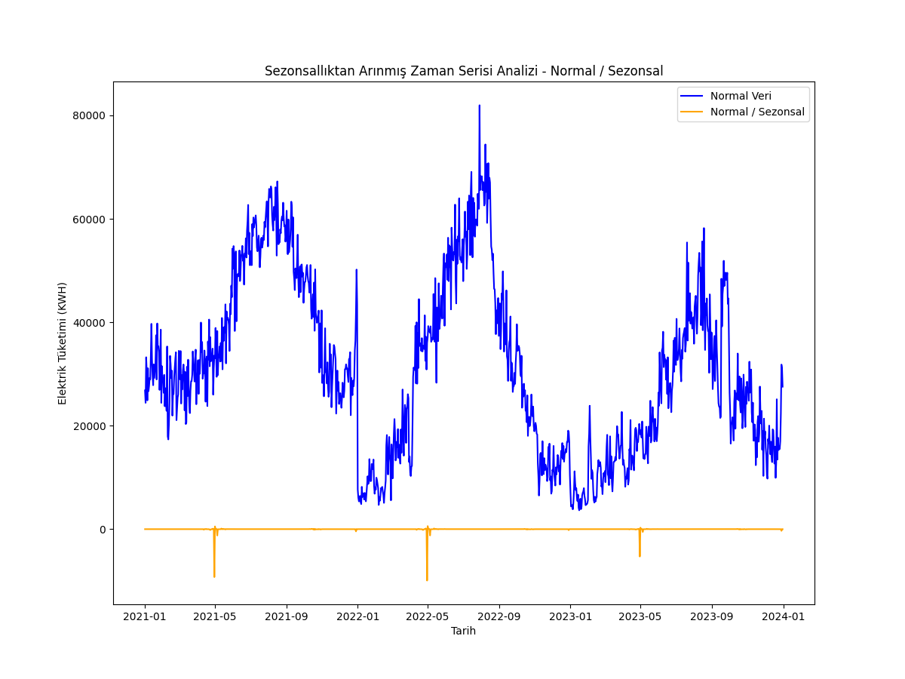
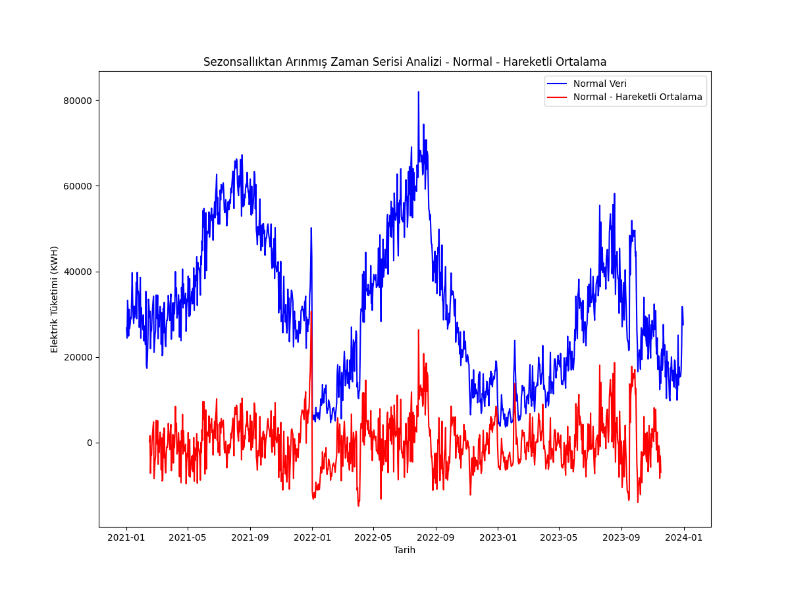
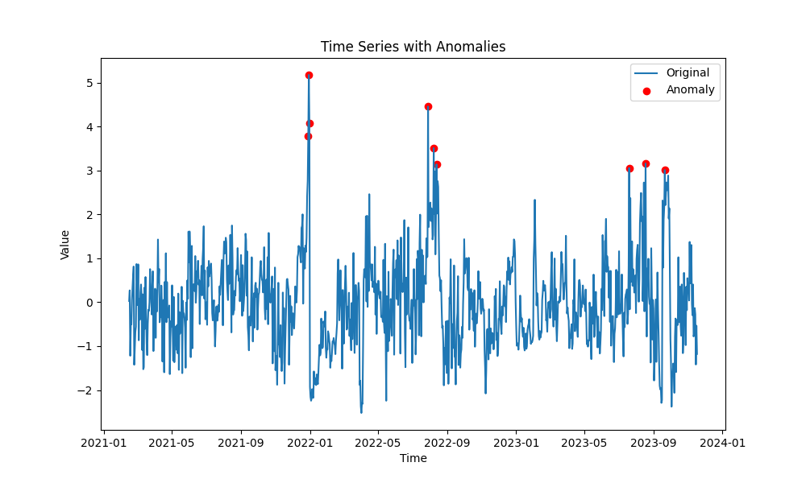
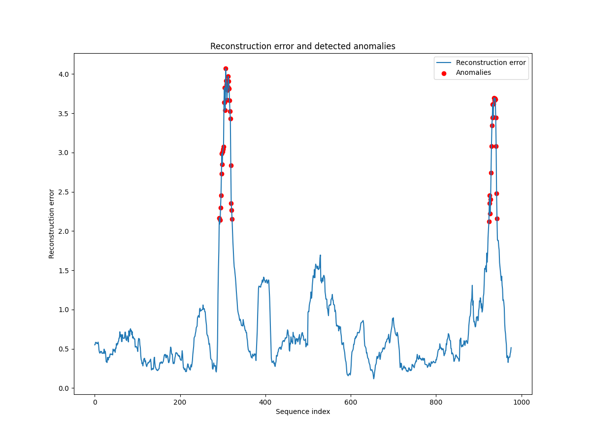
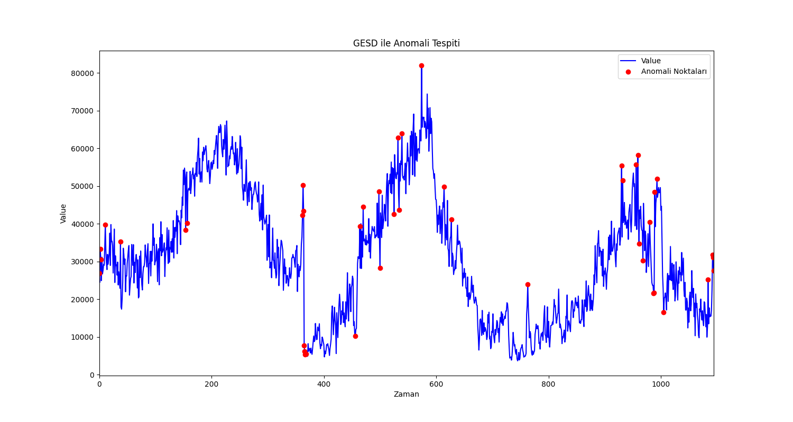
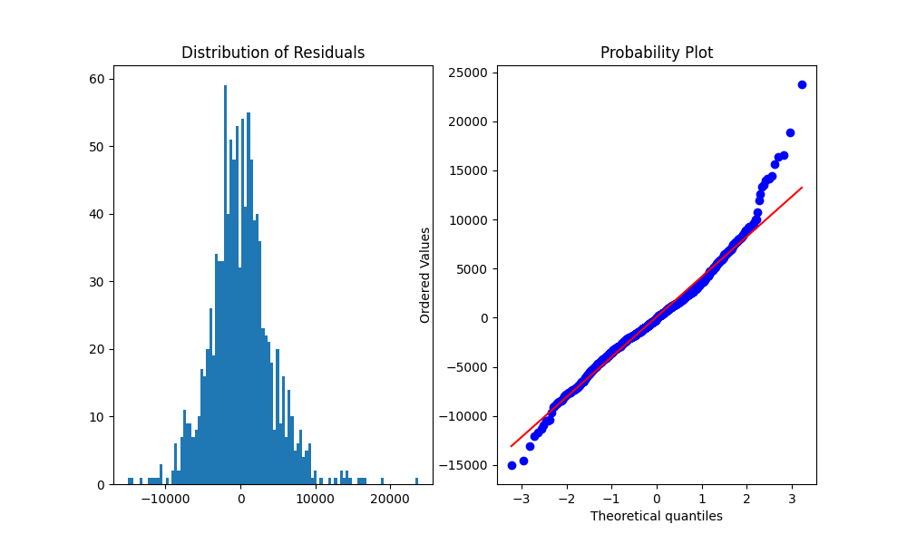

# TUBITAK 1711 TEKNOLOJİ RAPORU

## 1 - KULLANILAN KÜTÜPHANELER

- numpy: Dizi manipülasyonu ve sayısal hesaplamalar için kullanıldı
- pandas: Veri manipülasyonu ve analizi için kullanıldı, veri çerçevesi (data frame) yapıları sağlıyor
- matplotlib: Statik görselleştirmeleri oluşturmak için kullanıldı
- seaborn: İstatistiksel grafikler oluşturmak için kullanıldı, matplotlib üzerine inşa edilmiştir
- plotly: Yüksek seviyeli etkileşimli görselleştirmeleri oluşturmak için kullanıldı
- statsmodels: İstatistiksel modellerin tahmini ve testi için sınıflar ve fonksiyonlar sağlar
- tensorflow: Derin öğrenme ve sinir ağlarını inşa etmek için kullanıldı
- sklearn: Makine öğrenimi modellerini eğitmek, test etmek ve uygulamak için kullanıldı, geniş bir algoritma kütüphanesi sunar

## 2 - VERİ HAZIRLIĞI

- Otellerin sağlamış olduğu kullanım verilerinin incelenmesi sonucu X oteli seçildi ve modellerin keşfi için X otelinin 2019, 2022 ve 2023 yılları için günlük harcanan toplam elektrik değerlerinin kullanılmasına karar verildi.
- Her birinde günlük elektrik kullanımı bilgisi olan 3 yıl (2019, 2022, 2023) 3 ayrı veri çerçevesine ve 1 adet birleşim veri çerçevesine bölündü.
- 2019 yılı, 2021 olarak adlandırıldı.(Covid dönemi yüzünden çıkarılan 2020 ve 2021'in, grafikler üzerinde boşluğa sebep olmaması için)
- Sezonsal verinin yapay zeka modeli eğitimi ve daha sonra kullanılması aşamasında hatalı sonuçlar çıkarabilmesi sebebiyle[1], eğitimlere başlanmadan önce aynı veri kümesinin sezonsallıktan ayrıştırılmış hali de belirtildiği gibi veri çerçevelerine bölündü.
- Testler hem sezonsallıktan ayrılmış hem de normal veri ile yapıldı. Alınan iki sonucun karşılaştırılması sonucu daha hassas sonuç veren veri çerçevesi seçildi.
- 3 ayrı sezonsallıktan ayırma yöntemi uygulanması sonucu elde edilen veriler üzerine (Şekil 2.1, Şekil 2.2 ve Şekil 2.3'te görüldüğü üzere), normal veriden hareketli ortalama çıkarma yönteminin (Şekil 2.3) veri için en uygun sezonsallıktan ayırma yöntemi olduğuna karar verildi.

  
   
  <em>Şekil 2.1: Normal değerden "seasonal_decompose" metodu kullanılarak elde edilen sezonsallığın çıkarılmış hali</em>

  
   
  <em>Şekil 2.2: Normal değerin "seasonal_decompose" metodu kullanılarak elde edilen sezonsallığa bölünmüş hali</em>

  
   
  <em>Şekil 2.3: Normal değerden 90 günlük pencere seçilerek bulunan hareketli ortalamanın çıkarılmış hali</em>

## 3 - ANOMALİ TESPİT YÖNTEMLERİ

### 3.1 - Z Skoru ile Anomali Tespiti

- Bu yöntem, hangi verilerin normal dağılımdan saptığını bulmak ve verinin daha detaylı anlaşılması için kullanıldı.
- Z skoru, veri kümesindeki bir noktanın standart sapmadan ne kadar uzakta olduğunu gösteren (-∞, +∞) aralığında bir rasyonel sayıdır.
- Veri kümesindeki her nokta için ayrı ayrı z skoru bulunmuş olup z skoru 3σ'dan fazla olan noktalar anomali kabul edildi.
- Hem normal veri hem de sezonsallıktan ayrılmış veriyle ayrı ayrı denendiğinde sezonsallıktan ayrılmış veri daha hassas bir ölçüm yapmıştır. (Şekil 3.1)
- Şekil 3.1'de görüldüğü üzere Z skoru yöntemi, tek başına sadece bazı global ekstremum noktaların tespitinde işe yaramıştır.

  
   
  <em>Şekil 3.1: Sezonsallıktan ayrılmış birleşim veri çerçevesinin, z skoru 3σ'dan büyük noktaları</em>

### 3.2 - Otokodlayıcı ile Anomali Tespiti

- Otokodlayıcı, denetimsiz bir şekilde öğrenebilen bir tür yapay sinir ağıdır.
- Otokodlayıcının amacı veriyi temsil eden bir timsal vektörü öğrenmektir. Genel mimarisinde bir kodlayıcı bir de deşifre edici modüller içerir. (Şekil 3.2)

  
   
  <em>Şekil 3.2: Basitleştirilmiş bir otokodlayıcı mimarisi</em>

#### 3.2.1 - Varyasyonel Otokodlayıcı ile Anomali Tespiti

- Bir otokodlayıcı türü olan Varyasyonel Otokodlayıcı, veriyi kodlayıp deşifre etmenin yanında belirsiz uzayı(latent space) derinlemesine öğrendiği için veriyi kullanarak yeni veri noktaları oluşturabiliyor.
- Yeni veri noktaları oluşturabildiği için asıl kullanım alanı görüntü oluşturma olan varyasyonel otokodlayıcı, altta yatan veri dağılımını yaklaşık olarak belirleme özelliğinden dolayı kullanılmıştır.
- Sezonsallığından ayrılmış veri ile bir varyasyonal otokodlayıcı eğitilmesi sonucu Şekil 3.3'te görülen tablo sezonsal verinin varyasyonal otokodlayıcı ile uyumlu olmadığını gösteriyor.

  
   
  <em>Her bireysel noktanın deşifre işlemi sırasındaki yeniden oluşturulma hatasının grafiği</em>

#### 3.2.2 - Uzun Kısa Süreli Bellek(LSTM) Otokodlayıcı

- Başka bir otokodlayıcı türü olan LSTM otokodlayıcı uzun süreli hafızaya sahip olması ve veri kirliliğine karşı olan direnci sayesinde zaman serileri üzerinde tahmin ve anomali tespiti yapmak için son derece uygundur.
- LSTM otokodlayıcılar, verilerdeki uzun vadeli bağlantıları ve döngüsel özellikleri yakalayabilme yetenekleri sayesinde, zaman serilerinin gelecekteki değerlerini tahmin etmede veya veri setindeki anomalileri belirlemede yüksek doğruluk sağlar.
- Ayrıca, modelin veri kirliliğine ve gürültüye karşı gösterdiği direnç, gerçek dünya verileri üzerinde çalışırken büyük bir avantaj sağlar.
- Ancak bu avantajların getirdiği esneklik aynı zamanda çalışan bir modelin geliştirilmesini de zorlayıcı kılmaktadır.
- Şuanki modelin geliştirilmek için daha fazla veriye ihtiyacı vardır.

## 3.3 - Genelleştirilmiş Ekstrem Türetilmiş Sapma (Generalized Extreme Studentized Deviate)

- Standart dağılıma (Gaussian Distrubution) sahip veriler üzerinde anomali tespiti için kullanılan Grubb testi yanlızca 1 veya 0 anomali için kullanılabiliyor.
- Genelleştirilmiş Ekstrem Türetilmiş Sapma kısaca GESD, Grubb testinin özyinelemeli(recursive) bir şekilde çalıştırılması sonucu anomali tespitinde kullanılır. Bu sayede Grubb testi birden fazla anomaliyi tespit etmek için kullanılabilir.
- Yapılan testlerde Şekil 3.4'te görülebileceği üzere hem yerel hem de global ekstremum noktalarını bularak en doğru anomali tespitini yapan GESD yönteminin; Anderson-Darling testi dahil olmak üzere yapılan testler sonucu normal dağılıma sahip olduğu kanıtlanan,(Şekil 3.5) günlük elektrik kullanımı verisi için, en doğru anomali tespit yöntemi olduğuna karar verildi.
- Normal dağılıma sahip olan bütün zaman serisi verilerinin anomalileri GESD testi ile hassas bir şekilde tespit edilebilmektedir[2]

  
   
  <em>Şekil 3.4: Verinin kendisi kullanılarak yapılan GESD sonucu bulunan anomaliler</em>

  
   
  <em>Şekil 3.5: Verinin normal dağılıma sahip olduğunu gösteren grafikler</em>

## Referans

- [1] [Developments in Water Science, Volume 45, 1994, Pages 463-482.](https://www.sciencedirect.com/science/article/abs/pii/S0167564808706749)
- [2] [1.3.5.17.3. Generalized ESD Test for Outliers](https://www.itl.nist.gov/div898/handbook/eda/section3/eda35h3.htm)
